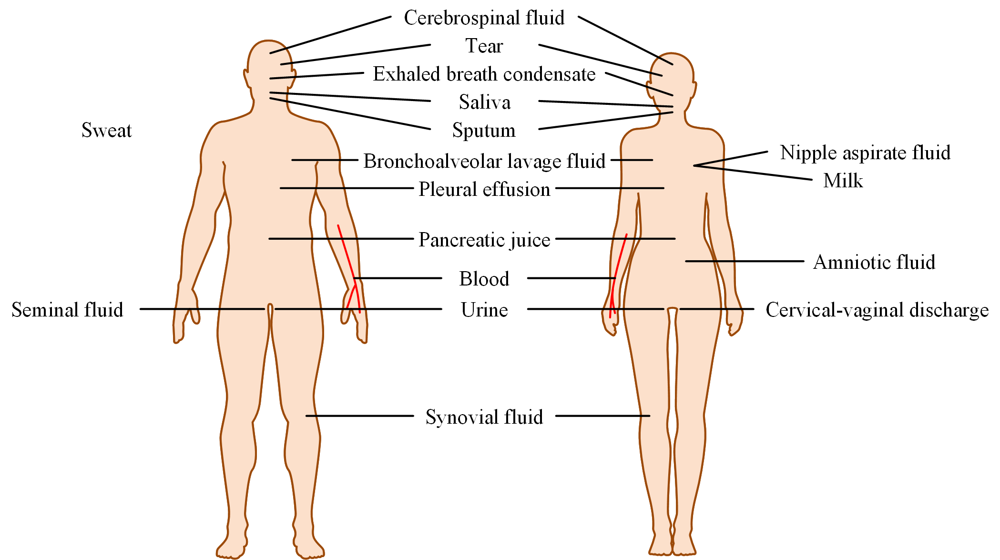

# Prediction Models for Body-fluid Protein Discovery

Body-fluid proteins are very important because they are promising as biomarkers.
This repository contains several prediction models for body-fluid protein discovery.

## Models

| Name     | Description                         | Type            | Script      |
|----------|-------------------------------------|-----------------|-------------|
| SVM      | Support Vector Machine              | Supervised      | svm.py      |
| DT       | Decision Tree                       | Supervised      | dt.py       |
| DNN      | Deep Neural Network                 | Supervised      | dnn.py      |
| DeepSec  | Deep Learning                       | Supervised      | deepsec.py  |
| MultiSec | Deep Learning + Multi-task learning | Supervised      | multisec.py |
| PU-DT    | DT + PU Bagging                     | Semi-supervised | pu-dt.py    |
| PU-SVM   | SVM + PU Bagging                    | Semi-supervised | pu-svm.py   |
| MPUSec   | Multi-task learning + PU Learning   | Semi-supervised | mpusec.py   |

## Data

Data can be downloaded from [this link](https://drive.google.com/file/d/17RaTchxxEwhyDHf7fo78te2zfjs8kJAT/view?usp=sharing).

## RUN

`python script_name.py --folder data_dir`

## Reference

- Dan Shao, Lan Huang, et al. 
Computational Prediction of Human Body-Fluid Protein. BIBM 2019.
- Dan Shao, Lan Huang, et al. DeepSec: A Deep Learning Framework for Secreted Protein Discovery in 
Human Body Fluids. Bioinformatics 2021.
- Kai He, Yan Wang, et al. MultiSec: Multi-Task Deep Learning 
Improves Secreted Protein Discovery in Human Body Fluids. Mathematics 2022.
- Kai He, Yan Wang, et al. A Multi-task Positive-unlabeled 
Learning Framework to Predict Secreted Proteins in Human Body Fluids. 
Complex & Intelligent Systems 2023.
